# Conservation Ethics Experiments Report

This report is valid for commit [4d0a7bf](https://github.com/agentsoz/bdi-abm-integration/commit/4d0a7bfecb28b32e466cf12d300a1a8c6ffb468c).


# Experiments

All experiments were repeated 30 times and each data point on the graphs below represents the average value from those runs.

## Sensitivity Analysis (SA)


Our initial experiments involved performing Sensitivity Analysis (SA) that examines how sensitive outputs of the model are to changes in its inputs. We explored the input parameter space of the variables listed in the table below. Fully exploring the permutations of this n-dimensional parameter space would be prohibitive. Instead our design of experiment involved generating just 33 samples (where a set of variables values constitutes a sample) selected using the Nearly Orthogonal Latin Hypercube (NOLH) method following (Sanchez 2005). This method works by taking samples of each input variable from even sized buckets across its range and combining those (nearly) orthogonally to give improved space-filling properties to the experiment design. The model was then run 30 times for each sample to account for its stochasticity, giving a set of 990 simulation runs on which SA was performed. 


| Parameter | Description | 
| :--- | :------------------------------------------------------------------- |
| `numberOfAgents` |  number of landholder agents in the simulation |
| `highCEAgentsPercentage` | Percentage of agents with high conservation ethic; value in range [0,100] |
| `targetPercentage` | Percentage of maximum possible target (if all agents bid on the highest package) that should be assigned as the target; value in range [0,100]  |
| `sigmoidMaxStepX` | Limits the amount by which the sigmoid function value can change in one step by limiting the max change in x by this value; value in range [0,100] |
| `profitMotiveUpdateMultiplier` | Multiplier in range [0.0,1.0] applied to `sigmoidMaxStepX` to calculate an agent's profit motive change|
| `socialNormUpdateMultiplier` | Multiplier in range [0.0,1.0] applied to `sigmoidMaxStepX` to control how quickly an agent's CE gravitates towards the social norm|
| `visitType` | Types of landholders visited by extension office; 0 (none) 1 (successful only), 2 (successful and unsuccessful only), 3 (all); increasing numbers represent an increasing proportion of landholders visited |
| `visitPercentage` | Percentage of landholders (selected by `visitType`) visited by extension office; value in range [0,100] |
| `visitPercentagePerLandholder` | Restricts the number of visits per landholder per round to a percentage of the maximum; value in range [0,100] |

The figure below gives the correlation results using Spearman's Rank Correlation Coefficient that gives the strength of the monotonic relationship between an input-output pair. Rows represent selected inputs, while the columns represent various outputs. Cells with numbers represent no significant correlation for the input-output pair. The cell numbers are the P-values. Where a correlation exists, it is shown with a circle and no associated number. The colour of the circles represents the sign of the correlation on a continuous scale between [+1.0,-1.0] as shown in the legend guide. Here a large dark blue circle represents a highly positively correlated input-output pair, and a large dark red circle represents a highly negatively correlated pair. 


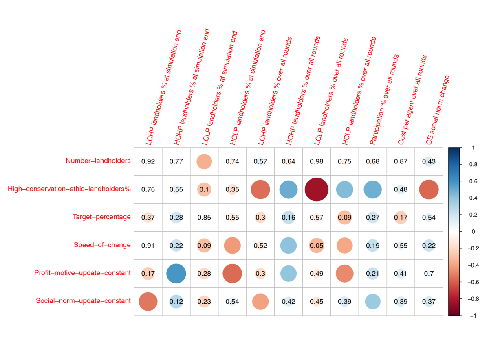

[**CHANGE THIS TO REFLECT GRAPH**] As one would expect, we see a positive monotonic correlation between `numAgents` and the absolute counts of agents in various classes at the end of the simulation. We also find that increasing `targetPercentage` tends to lower the number of winners overall in various categories and is an artifact of the underlying auctioneer model. Given the sensitivity of the model to these parameters, after discussion with authors, for all further experiments, these parameters were fixed to `numberOfAgents=100` and `targetPercentage=12`.  *Note that where a correlation is not detected for an input-output pair by the Spearman’s coefficient, a non-monotonic relationship could still exist between the pair.*

[**TODO:**] *Need to find a SA test for non-monotonic correlations that are likely to exist but are not picked up here.* 

## Comparing starting populations with 25% and 75% HC agents  

Our first set of simulation results show the emergence of motivational crowding out, where monetary reward (profit) can negatively impact the intrinsic motivation to conserve (conservation ethic). The figure below shows how the percentage of high-conservation (HC) and high-profit (HP) agents changes over successive auctions, in two different initial populations: 
* **HC25** that starts with 25% HC agents and 50% HP agents, and 
* **HC75** that starts with 75% HC agents and 50% HP agents. 

In HC25, the relatively higher starting proportion of HP agents leads to greater profit chasing and overall the conservation ethic in the population declines, from a combination of unsuccessful bids leading to lower participation in the HC group, and the negative effect on CE from observed profits of others. In contrast, for HC75 where the relative proportion of HC agents in the population is high to start with, the population as a whole establishes a high conservation ethic, largely from the pull towards the established (higher) conservation norm in the society.

| HC25: types of agents over time | HC75: types of agents over time |
| :---: | :---: | 
| 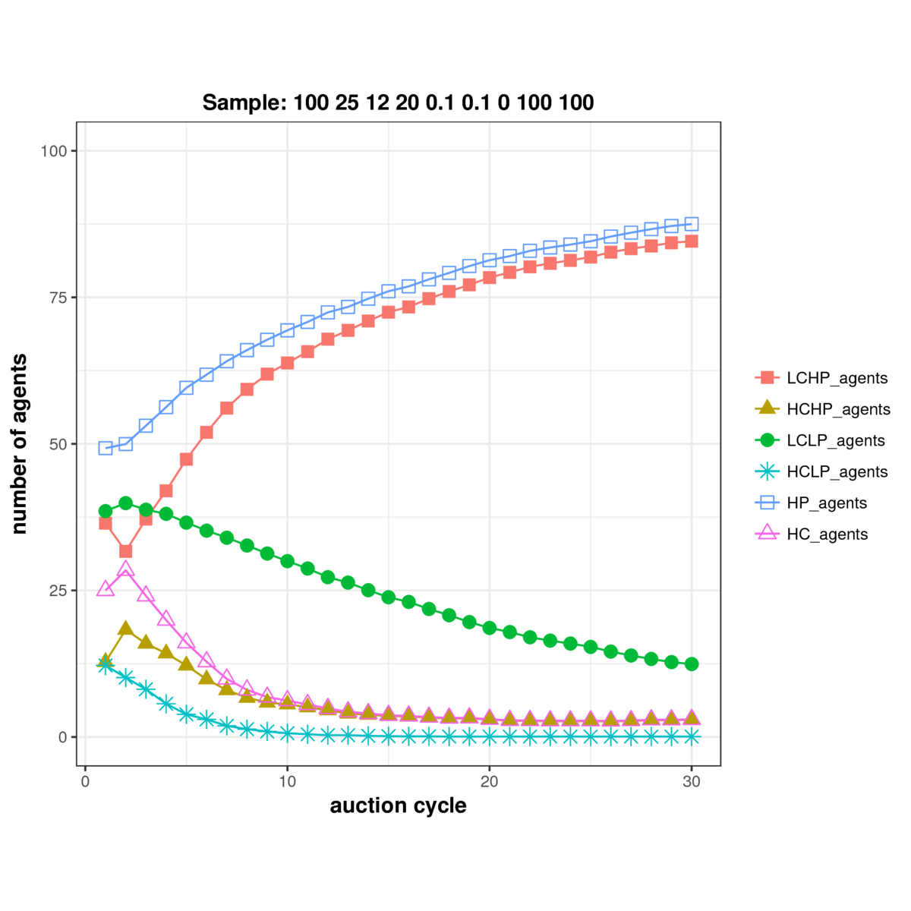 | 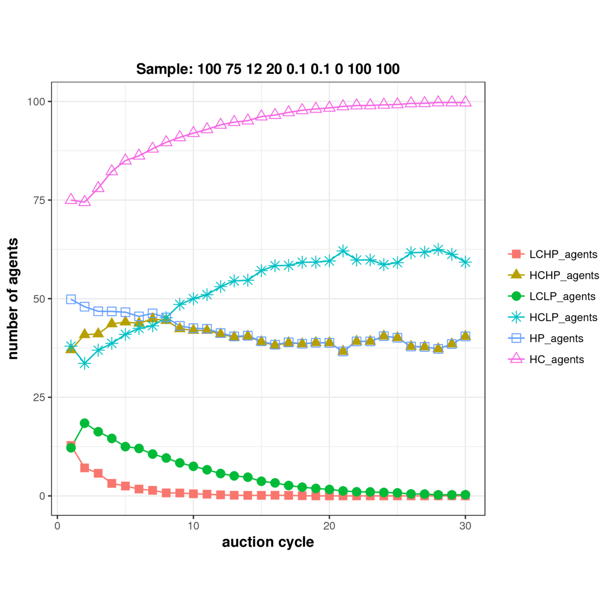 |

We also find significant and interesting differences in the two populations with respect to the auction participation rate over time as shown next in Figure 3. In HC75 the overall participation rate starts at ~65% and steadily increases and settles at ~80%. This is due to an increase in the number of HC agents, who tend to participate more than HP agents. In contrast, in HC25 the initial participation rate is significantly lower at ~45%. Moreover it drops sharply to well below half that in the first few rounds, before gradually climbing back to the initial level. This U-shape is driven predominantly by the behaviour of HP landholders, of which those also with high CE (HCHP) are declining in number while those with low CE (LCHP), who bid more as profits increase, are gradually getting more involved. Comparing populations, at round 10 the total participation rate for HC75 was ~5x that of HC25, and summing over all rounds, ~3x more landholders participated in HC75 than in HC25. 

| HC25: participation over time | HC75: participation over time |
| :---: | :---: | 
| 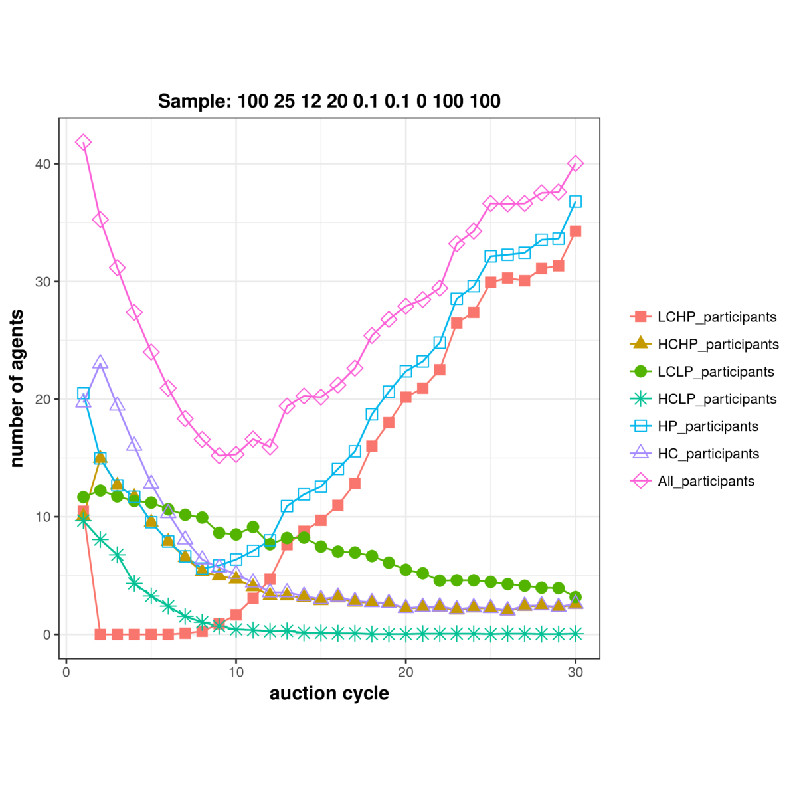 |  |

Next we look at the difference in cost to the agency between the two sample populations, and how this cost varies over time. Figure 4 shows the result. We find that in HC25, as the high profit seeking behaviour increases over time, the cost to the agency also steadily increases. In comparison, in HC75, the cost starts off slightly lower, and stays relatively constant over time. This is because the latter has more HC agents, who tend to bid with moderate to low profit margins. After 30 rounds, the cost of auctions for HC25 is more than double that of HC75. The cumulative cost over all rounds for HC25 is ~70% higher than HC75. This is despite the fact that the participation rate for HC75 is much higher than HC25 as already shown.

| HC25: cost of auctions over time | HC75: cost of auctions over time |
| :---: | :---: | 
| 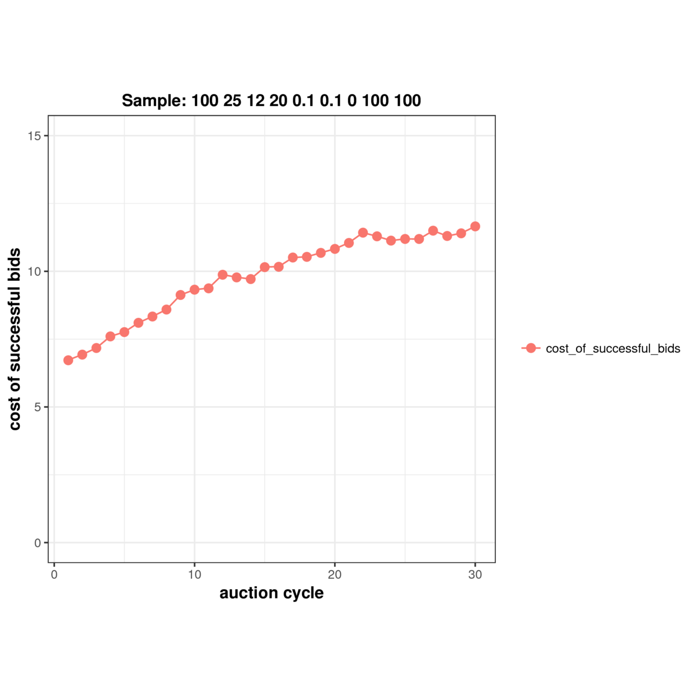 |  |


[**OLD TEXT. RESULT NOT VERIFIED YET**] *Finally, we explored the impact of social cohesion–the degree to which the CE of a landholder is influenced by the conservation norm. To do this, we created two versions each of our HC25 and HC75 populations—one with low social cohesion and one with high–giving us four populations, and repeated our experiments. Figure 3 shows how social cohesion impacts cost. Compared to the experiment in Figure 2–where the social cohesion was moderate–we find that an increase in social cohesion leads to an overall increase in HC landholders due to the stronger influence from the conservation norm. This in turn results in overall costs being substantially less than in the earlier case with moderate social cohesion.*

## Understanding the impact of Extension Officers visits (Case 1)

This experiment introduces the notion of extension officer visits. In this setting, it is assumed that the extension office has sufficient funds to support officer visits to each landholder that has an active contract. Won contracts stay active for 3 years in the model, and all landholders with active contracts are visited once per round. The impact of a visit on a landholder is a boost in her conservation ethic (along the S-curve).

The types of agents over time for HC75 is very similar with or without visits. For HC25 though, we see an interesting effect from the visits. In the early rounds, the number of HC agents increases due to the boost in conservation ethics from the visits. However, after around 10 rounds, we find that the HC population as a whole stays fairly constant. Within the HC population, those with high profit motive (HCHP) continue to increase in numbers, while those with low profit motive (HCLP) start to decrease. The overall impact is that by round 30, almost all landholders in the population have a high profit motive!

| HC25: types of agents over time | HC75: types of agents over time |
| :---: | :---: | 
| 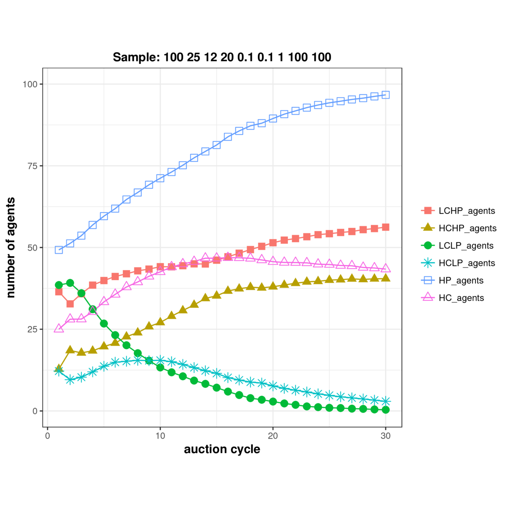 | 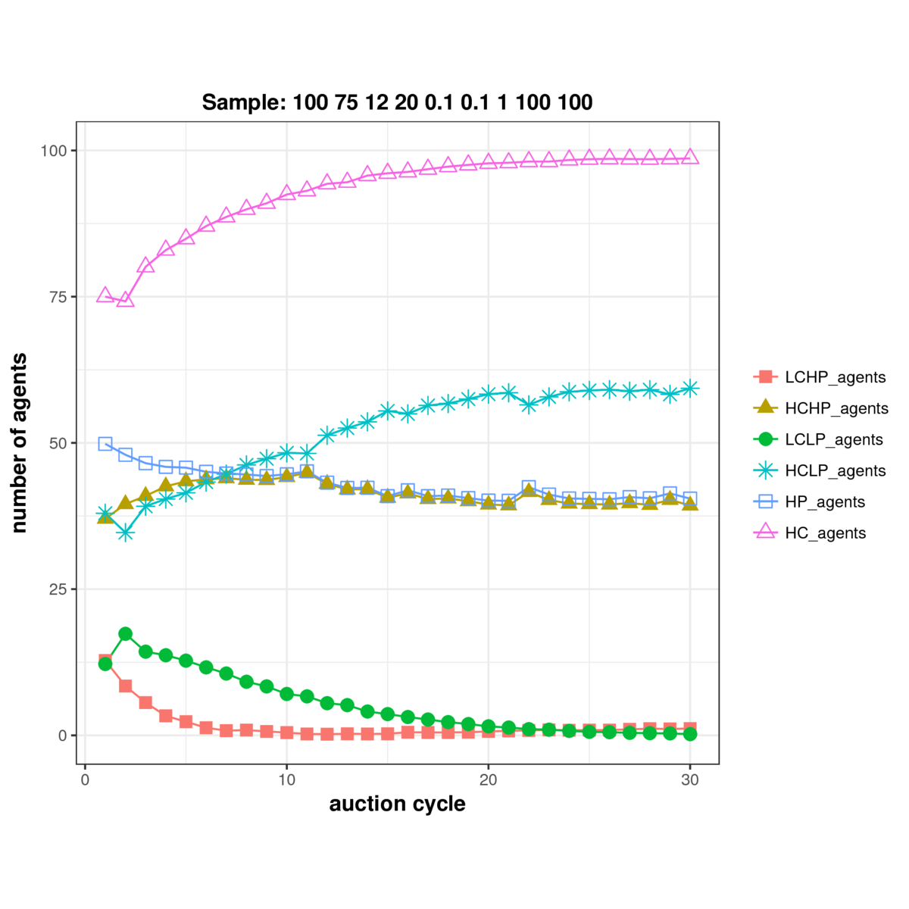 |

Participation rates for HC75 with or without visits are very similar. However, for HC25 with visits we no longer see a drop in participation as we did for the original setting without visits. Now the participation rate stays fairly constant over time. So visits have resulted in an overall increase in participation in the HC25 population. This is due to the overall increase in the HCHP agents who tend to participate more.

 
| HC25: participation over time | HC75: participation over time |
| :---: | :---: | 
| 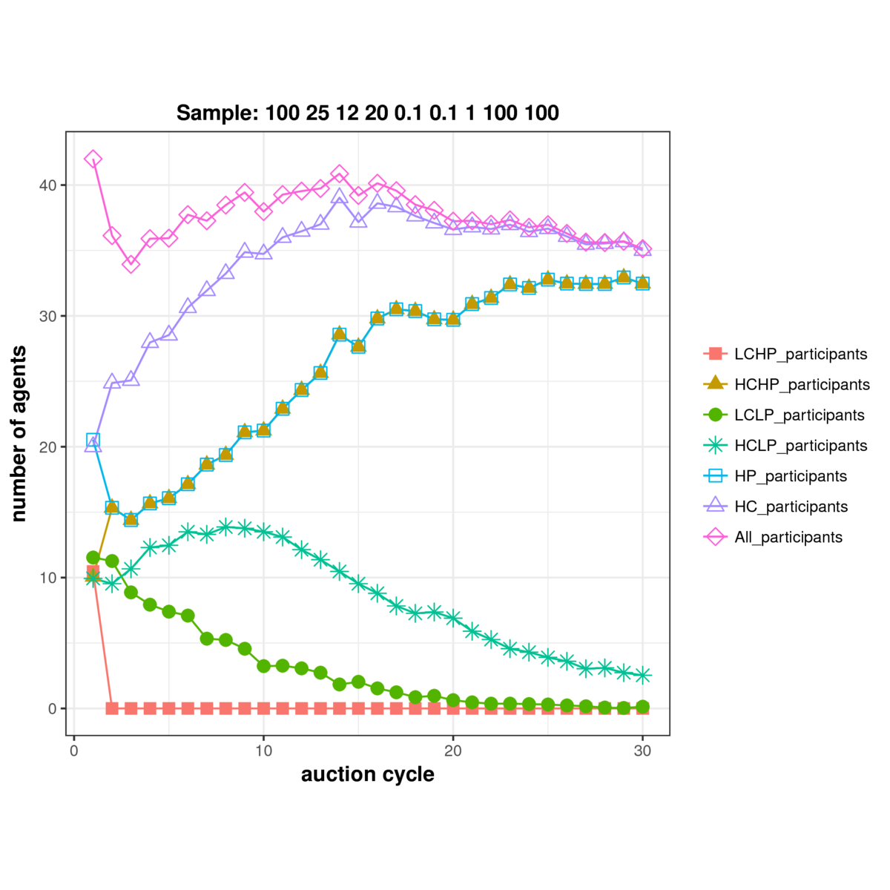 | 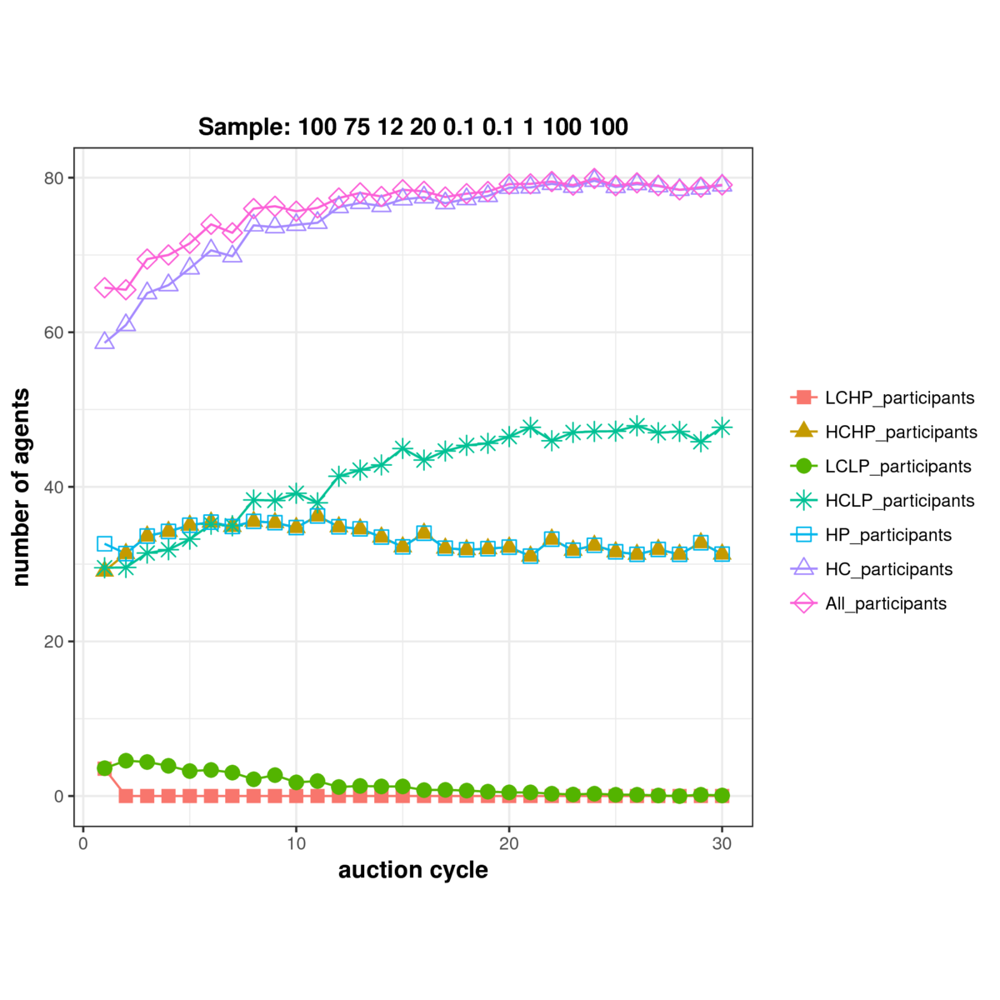 |

After 30 rounds, the cumulative cost over all rounds for HC75 is the same as in the case without visits, as shown below. However, for HC25 the accumulated cost with visits is 27% lower than when there were no visits (down from 295 to 214). This is interesting, given that the entire population almost exclusively has high motive profit. The reason why the costs are lower though is that about half of those agents also have high conservation ethics (HPHC) and tend to place bids with moderate profit margins compared to those with high profit and low conservation ethics (HPLC) who dominate the original setting. 

| HC25: cost of auctions over time | HC75: cost of auctions over time |
| :---: | :---: | 
| 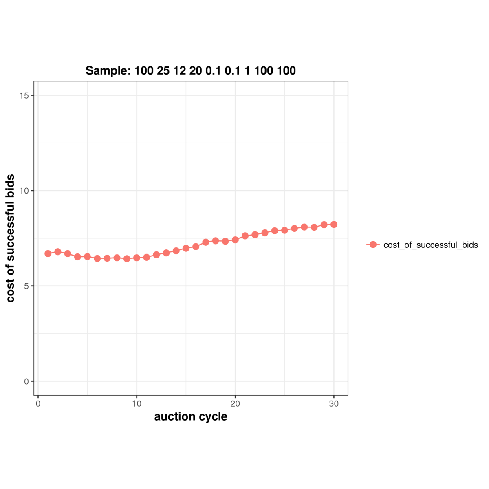 | 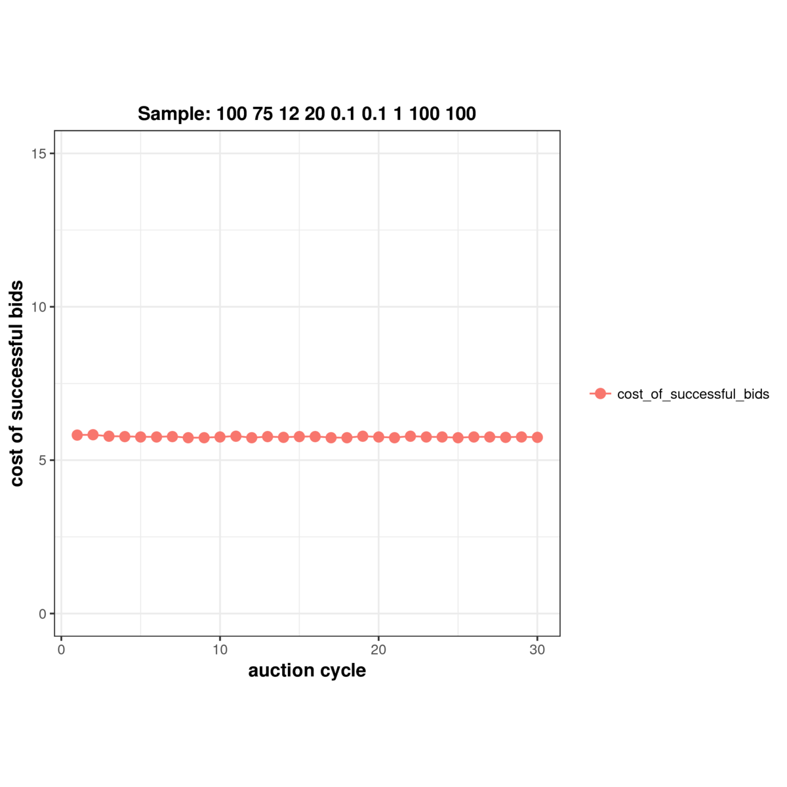 |

## Understanding the impact of Extension Officers visits (Case 2)

While in Case 1, the extension officer visits were restricted to successful landholders with active contracts only, in this setting we look at the impact of increasing the visits to also include unsuccessful bidders from the latest auction round. 

The results are plotted in the figures below. In Case 2, we see no significant difference in the HC75 population from the increased visits, i.e., the types of agents over time, their participation, and the cost to the agency is comparable to Case 1. In the HC25 population however, we see quite interesting results. First, the extra visits have tipped the balance with respect to the makeup of the final population: whereas in Case 1 in the final population almost all landholders had high profit motive, now they all have a high CE! The participation rate for HC25 has also almost doubled to ~75%. Finally, the cost to the agency has a slightly downward trajectory in contract to Case 1 where the cost while lower than without visits, was still trending upwards. The cumulative cost in Case 2 is 14% lower than Case 1 (down from 214 to 185). 

| HC25: types of agents over time | HC75: types of agents over time |
| :---: | :---: | 
| 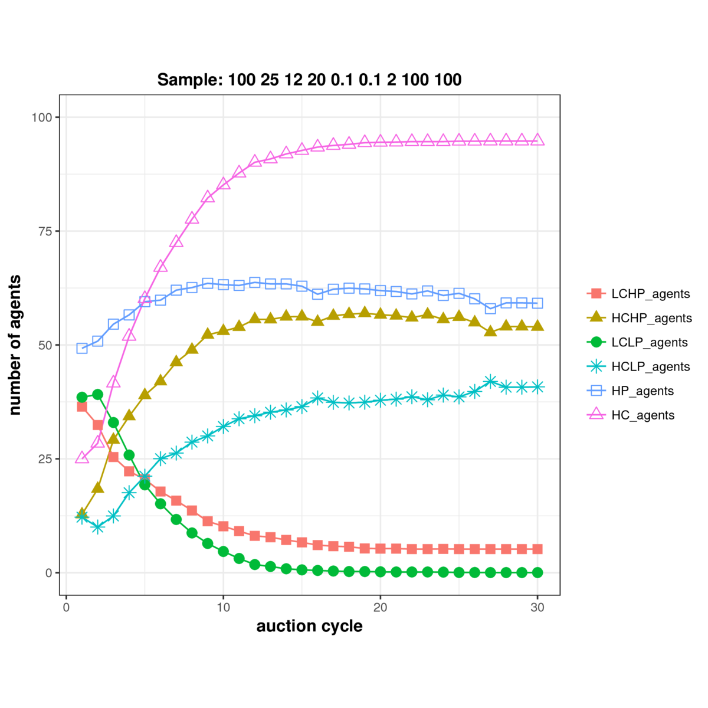 | 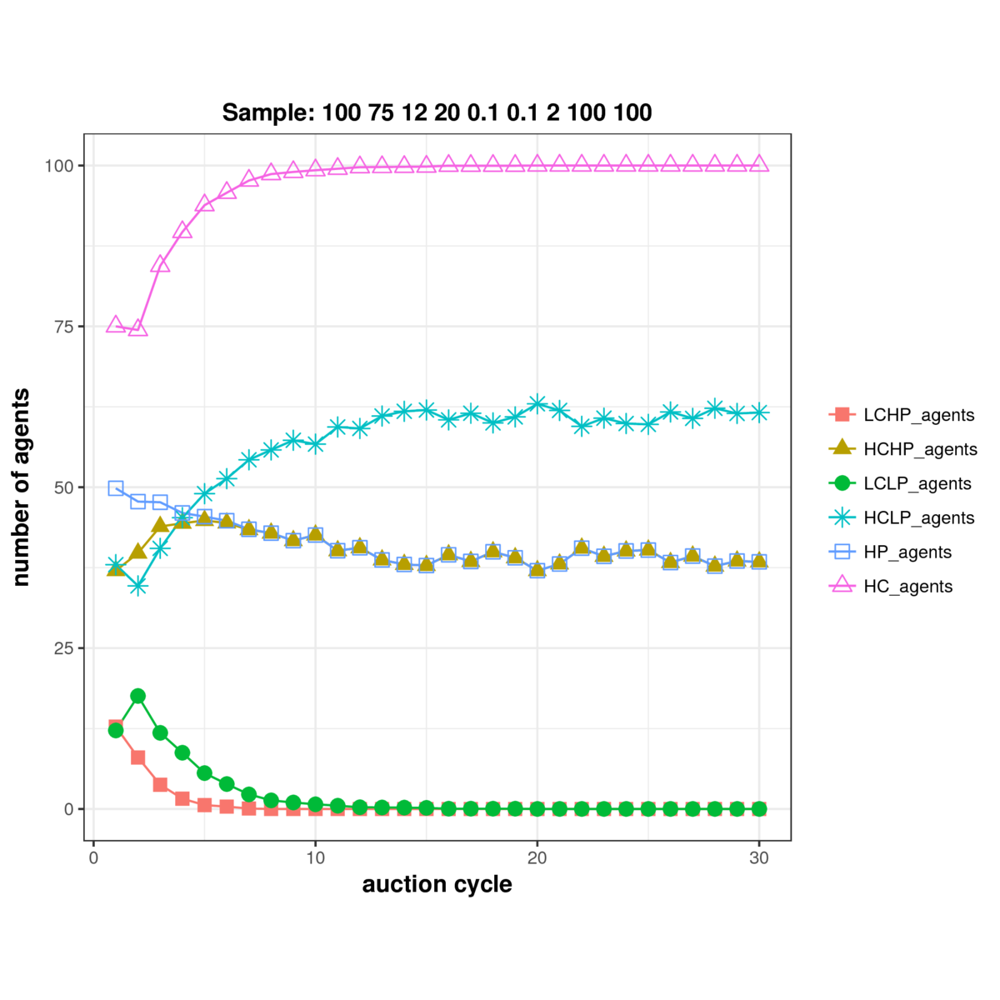 |

| HC25: participation over time | HC75: participation over time |
| :---: | :---: | 
|  |  |

| HC25: cost of auctions over time | HC75: cost of auctions over time |
| :---: | :---: | 
| 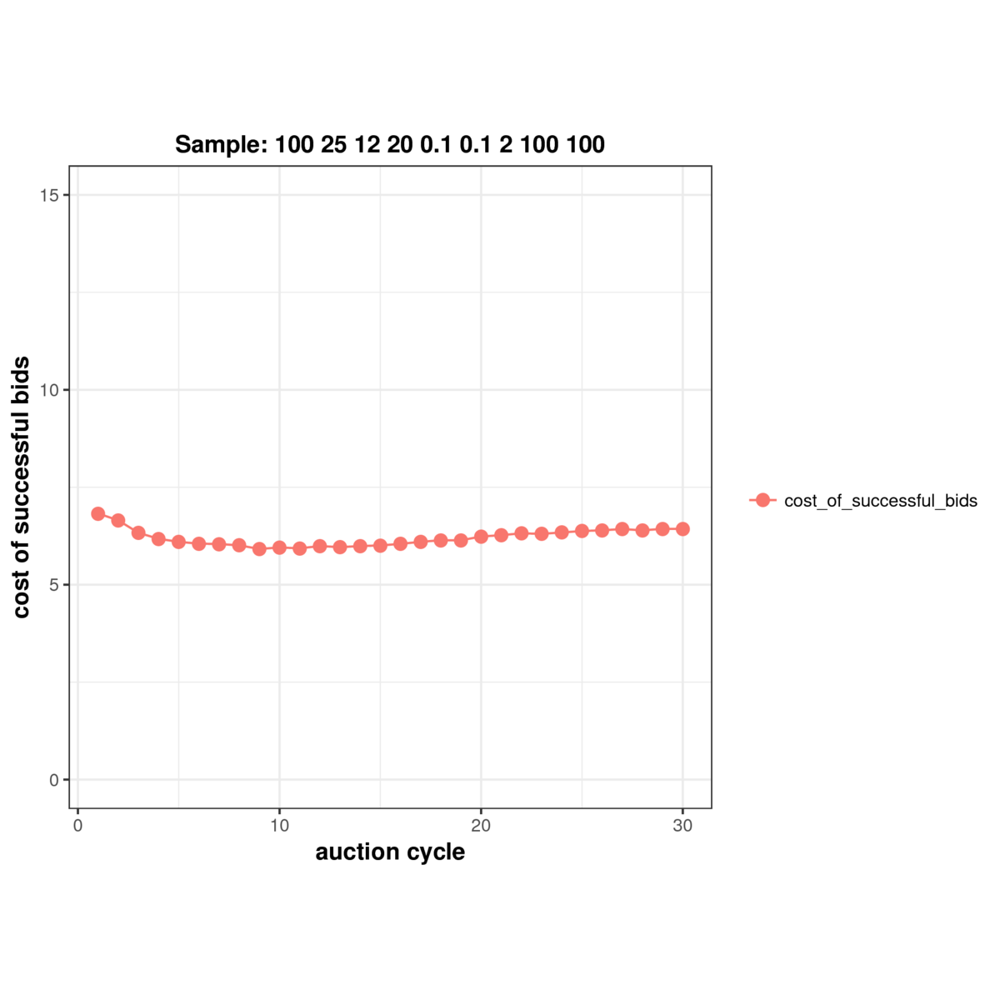 |  |


# About the Experiments

The experiments can only be run on Sarah's old Macbook Pro (MBP) laptop at the moment. That is because the GAMS license we have is tied to that machine. To make running tests easier, we have a script that can launch the tests remotely so that we do not need physical access to the machine. The script assumes that you have SSH configured so that you can login to the machine without a password, or in other words the command `ssh gams-machine` should get you in. You will want to set that up first. Once you have done that, the experiments can be launched from any remote machine. 

The following sections describe the steps involved in running the experiments.


## Building the distribution

For instructions on how to build the distribution see the conservation [README.md](../README.md).

## Running the experiments

* *NOTE: the scripts are not configured to allow experiments to run in parallel, so don't try that!* Run one experiment at a time, then download all the results (instructions on this further below) before running the next experiment.

### Sensitivity Analysis

Sensitivity Analysis (SA) samples are generated using the Nearly Orthogonal Latin Hypercube (NOLH) method. If you wish to add new parameters to the Latin Hypercube, edit the [NOLH spreadsheet](../test/NOLHdesigns_v5.xls) and then cut and paste the samples that the spreadsheet generates into [samples.txt](../test/output/samples.txt) (*note that the separator is the TAB character, and not spaces*). You will also have to update the number of samples in [config](../test/output/config).


To run the SA experiments, change to the [test](../test) directory and do the following:
```
./run-on-gams-machine
```
This will SSH to the GAMS MBP and launch the tests there. The run may take a while depending on the number of samples, and the number of replicates (repeats) per sample. Roughly, each run takes about a minute, so if you have 17 samples running 20 replicates each, then you'll be looking at something in the order of 17*20 minutes for the experiments to complete.  

### Running HC25/HC75 experiments

To run these experiments, change to the [test](../test) directory and do the following:
```
./run-on-gams-machine ./run-hi-ce-comparison.sh
```

These experiments take about one hour to run. 


## Analysing the results

1. Download all the results from the GAMS MBP onto your machine. To do that, create a directory to save the results in (name it something meaningful such as `testing-20170801-f5acd62-sa` so that you know what code version the experiments correspond to). Then do something like:
```
rsync -avz gams-macbook:testing/ testing-20170801-f5acd62-sa/
```

2. Now we will post process our results into a database, to make further analysis and plotting easier. To to that, change to the [test](../test) directory and run the `postproc.sh` script, pointing it to the test results directory that contains the `samples.txt` file. For example, if the directory structure is `./testing-20170801-f5acd62-sa/test/output/samples.txt`, then you would do something like:
```
./postproc.sh ./testing-20170801-f5acd62-sa/test/output/
```
For the HC25/HC75 experiments, a convinience script will do this for all the scenarios:
```
./postproc_hi_ce.sh  ../testing-20170816-5c3a824-hice/
```
3. Finally, you can plot the results. To do that, change to the [new scripts directory](../test/new) and try the following kinds of commands to plot various results (they all get saved in the same directory as the `output.db` database):
```
./correlation.R ../../testing-20170801-f5acd62-sa/test/output/ 30
./plot_number_of_agents.R ../../../testing-20170801-f5acd62-hice/test/output/ 30
./plot_hi_ce_comparison.sh
```
Here the parameter `30` refers to the number of auction cycles that were run. All plots are saved as PDFs in the same directory as the corresponding `output.db`. 

The figures included in this report were converted from PDF to PNG format. Yes, there's a script for that :smiley:. In the same directory as this report, do something like the following:
```
./collate-results.sh ../testing-20170801-f5acd62-sa/ ./testing-20170801-f5acd62-sa
```
This will search in the `../testing-20170801-f5acd62-sa/` input directory recursively for all PDFs, and copy them over to the new directory `./testing-20170801-f5acd62-sa` (it maintains the original directory structure), and then converts all PDFs to PNGs. Any multipage PDFs will be converted to several PNG files, one per page. The output image files will be placed alongside the copied PDFs. 

# About the model

[**TO DO**] *Describe how the sigmoid (S-curve) is used in the model.*

# About this report

[This report](./README.md) is written in [Markdown](https://daringfireball.net/projects/markdown/). The [HTML version of this report](http://htmlpreview.github.io/?https://github.com/agentsoz/bdi-abm-integration/blob/master/examples/conservation/report/README.html) was produced using [Pandoc](http://pandoc.org) with the following command:
```
pandoc -s --toc -f markdown_github -t html5 -c ./github-pandoc.css README.md  > README.html 
```

Any questions, just ask [me](https://github.com/dhixsingh).

